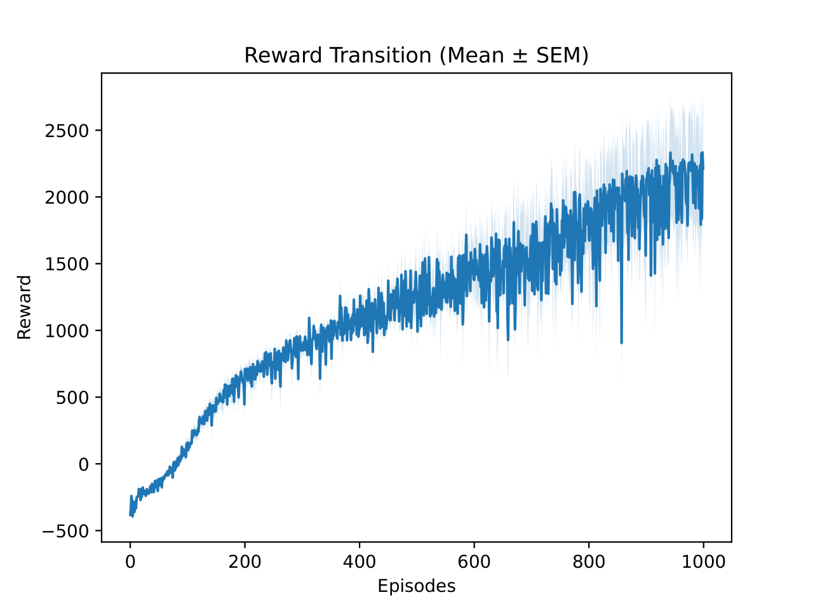

# KIPPO: Unofficial PyTorch Implementation

## **Koopman-Inspired Proximal Policy Optimization**

<p align="center">
    
    
</p>

<p align="center">
  <em>Left: Learned policy behavior — Right: Training result</em>
</p>

Training result

> *Unofficial implementation by Bluehorse-hub – PyTorch, 2025*

> [!Note]
> This repository provides an **unofficial PyTorch implementation** of the algorithm introduced in the paper  
> *“Koopman-Inspired Proximal Policy Optimization (KIPPO)”*.  
> The goal of this implementation is to reproduce the main training structure and workflow  
> described by the original authors using **PyTorch** for clarity and educational purposes.

---

## Reference

> [!Important]
> **Koopman-Inspired Proximal Policy Optimization (KIPPO)**  
> Andrei Cozma *et al.*, *University of Tennessee, Knoxville*, 2025  
> [arXiv:2505.14566](https://arxiv.org/abs/2505.14566)  
> DOI: [10.48550/arXiv.2505.14566](https://doi.org/10.48550/arXiv.2505.14566)

All credit for the original ideas and theoretical foundations goes to the authors of the paper.  
This repository was created **solely for research and educational purposes**,  
and is **not affiliated with or endorsed by the original authors**.

## Overview
This repository provides an **unofficial PyTorch implementation** of  
*“Koopman-Inspired Proximal Policy Optimization (KIPPO)”*.

As the original authors have not released their official implementation at the time of this work,  
this project was **independently developed based on the algorithmic descriptions in the paper**.  
It aims to reproduce the training framework, architecture design, and Koopman–policy interaction  
for educational and experimental exploration.

The focus is on:
- clear modular design for Koopman and policy networks  
- stable joint training through gradient isolation  
- reproducibility and extensibility for continuous control tasks

---

## Environment Setup

### Conda Environment

This project uses a reproducible **Conda environment**.  
You can recreate it directly using the provided `config/env.yaml` file:

```bash
conda env create -n KIPPO -f config/env.yaml
conda activate KIPPO
```

### Tested Hardware & System

| Component | Specification |
|------------|----------------|
| OS | Ubuntu 22.04.5 LTS |
| Python | 3.9.23 (via Conda) |
| PyTorch | 2.5.0 (CUDA 11.8, cuDNN 9.1.0) |
| CUDA Toolkit | 11.8 / Driver compatible with 12.x |
| GPU | NVIDIA GeForce GTX 1080 |
| Memory | 64 GB |

---

## Usage

### Training

By default, the script runs training on **HalfCheetah-v5**.  
To start immediately, simply execute:

```bash
python train.py
```

### Testing

To evaluate a trained policy:

```bash
python test.py
```

If you have your own checkpoint from training:

```bash
python test.py　--actor_weight　your/actor.pth --state_encoder_weight your/state_encoder.pth
```

During testing, evaluation videos are automatically generated and saved in the `video/` directory.

> [!CAUTION]
> When running on servers or environments without a display (e.g., SSH, WSL, Docker), MuJoCo or OpenGL rendering may fail with errors such as:

```
mujoco.FatalError: gladLoadGL error
```

In such cases, set the following environment variable **before running the script:**

```
export MUJOCO_GL=osmesa
```

This enables offscreen rendering using OSMesa, allowing video generation to work correctly even without a display.

Example (for headless testing on a remote server):

```
export MUJOCO_GL=osmesa
python test.py
```

## Project Structure

The project is organized for clarity and modularity, separating Koopman dynamics, policy optimization, and utilities.  
Each component can be extended or replaced independently for further research.

```bash
KIPPO/
├── train.py                 # Main training script (Koopman × PPO joint learning)
├── test.py                  # Evaluation script (policy testing & video generation)
│
├── config/                  # Environment configuration
│   └── env.yaml
│
├── models/                  # Core learning components
│   ├── Agent/               # PPO-based policy networks
│   │   ├── Actor.py         # Actor network
│   │   ├── Critic.py        # Critic network
│   │   ├── PPO.py           # Policy optimization logic
│   │   ├── ReplayBuffer.py  # Experience buffer for PPO
│   │   └── RewardNormalizer.py
│   └── Koopman/             # Koopman operator and latent dynamics
│       ├── StateAutoEncoder.py
│       ├── ActionEncoder.py
│       ├── ControlMatrix.py
│       ├── StateTransitionMatrix.py
│       ├── LossFunction.py
│       ├── KoopmanBuffer.py
│       └── Koopman.py
│
├── utils/                   # Utility functions and managers
│   └── manager.py           # Logging, experiment directories, checkpoint handling
│
├── content/                 # Visual outputs for documentation
│   ├── KIPPO.gif            # Policy behavior demo
│   └── reward_transition.pdf
│
├── sample/                  # Minimal pretrained models for quick testing
│   ├── actor.pth
│   └── state_encoder.pth
│
├── debug/                   # Debug scripts
│
├── LICENSE                  # MIT License
└── README.md
```

## License

This project is released under the **MIT License**.  
You are free to use, modify, and distribute this code for research and educational purposes.  
See the [LICENSE](./LICENSE) file for full license details.

## Disclaimer & Acknowledgements

This repository provides an **unofficial PyTorch implementation** of  
*“Koopman-Inspired Proximal Policy Optimization (KIPPO)”*.  

The implementation was developed **independently** based on the algorithmic descriptions in the paper,  
as the original authors have not released official code at the time of development.  

All credit for the original ideas, formulations, and theoretical contributions goes to the paper’s authors.  
This project was created **solely for research, learning, and demonstration purposes**,  
and is **not affiliated with or endorsed by the original authors**.

> Special thanks to the research community exploring **Koopman-based Reinforcement Learning**,  
> whose work has greatly inspired this reimplementation.